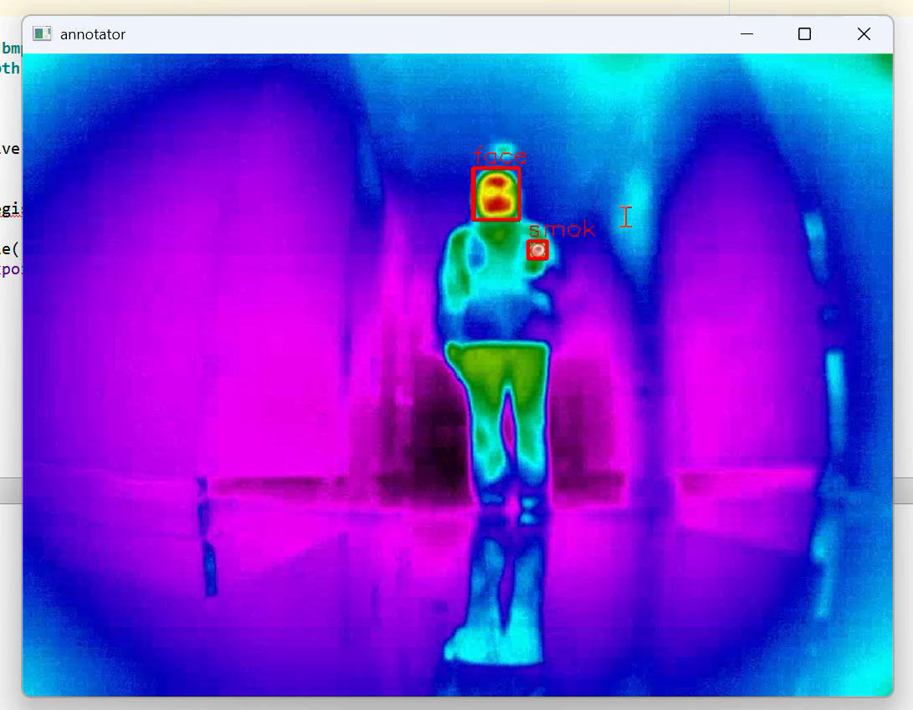

# SAMlabel
基于分割一切大模型（SAM）的数据集标注软件


# SAM-YOLO 半自动标注小工具（test.py）

> 够用版 · 无完整 UI · 单文件脚本  
> 位置：`SVMLabel\SVMlabel\SVMlabel\segment-anything-main\segment-anything-main\utils\test.py`

---

## 1. 能干嘛
| 功能 | 快捷键 / 操作 |
|---|---|
| 手画矩形 prompt | 鼠标左键拖拽（绿框） |
| SAM 自动优化框 | 松手即生成（蓝框） |
| 确认并输入类别 | `Y` → 弹出英文类别名 |
| 撤销当前图最后一条 | `N`（实时保存） |
| 上一张 / 下一张 | `A` / `D`（实时保存） |
| 退出并全部落盘 | `Q` 或 `ESC` |

输出：  
- 与图片同名的 **YOLO 格式 `.txt`**（归一化 `cls x_c y_c w h`）  
- `classes.txt`（类别映射，每步自动更新）

---

## 2. 一分钟上手
教程视频(bili)：https://www.bilibili.com/video/BV1ACkeBgEmY/
使用效果：

1. 装好依赖  
```bash
pip install opencv-python torch torchvision
# SAM 官方库
git clone https://github.com/facebookresearch/segment-anything.git
cd segment-anything
pip install -e .
```
2. 把权重文件（如 `sam_vit_h_4b8939.pth`）放到任意路径，修改脚本顶部 `SAM_CKPT` 变量即可。  （权重文件去SAM官方库位置下载：https://github.com/facebookresearch/segment-anything）
3. 修改脚本顶部 `IMG_DIR = r'E:\your_images'` → 指向自己的图片文件夹。  
4. 双击 / 命令行运行：
```bash
python test.py
```
5. 按提示画框 → 输入英文类别 → `Y` 确认 → `D` 切下一张；全部标完按 `Q` 退出。  
**中途崩溃也不丢数据**——每步操作立即写盘。

---

## 3. 按键一览
| 键 | 作用 |
|---|---|
| 鼠标左键拖拽 | 画 prompt 框（绿） |
| `Y` | 确认当前蓝框 → 弹出类别输入 |
| `N` | 撤销本图最后一条标注（实时保存） |
| `A` / `D` | 上一张 / 下一张（实时保存） |
| `Q` 或 `ESC` | 退出并整体再保存一次 |

---

## 4. 文件说明
- `test.py`  单文件脚本，复制即用  
- `classes.txt` 类别映射（自动创建/更新）  
- `*.txt`   与图片同名的 YOLO 标签（自动创建/更新）

---

## 5. 已知限制（够用版）
- 仅支持单类矩形框（SAM 外接矩形）  
- 类别名仅限英文（无空格）  
- 无批量删除/合并等高级功能  
- 无完整 GUI，纯 OpenCV 窗口

---

## 6. 后续想升级？
- 加批量删除 / 多边形 / 旋转框 → 换 `labelme` 或自行扩展  
- 想更快 → 换 SAM-HQ / EfficientSAM  
- 想要中文类别 → 改 `askstring` 输入校验即可

---

**Done.** 标完直接拿 `*.txt` + `classes.txt` 喂 YOLOv5/v8 训练，收工！